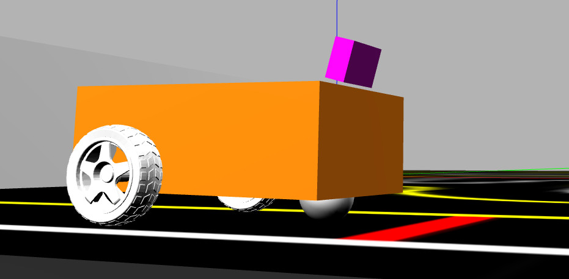
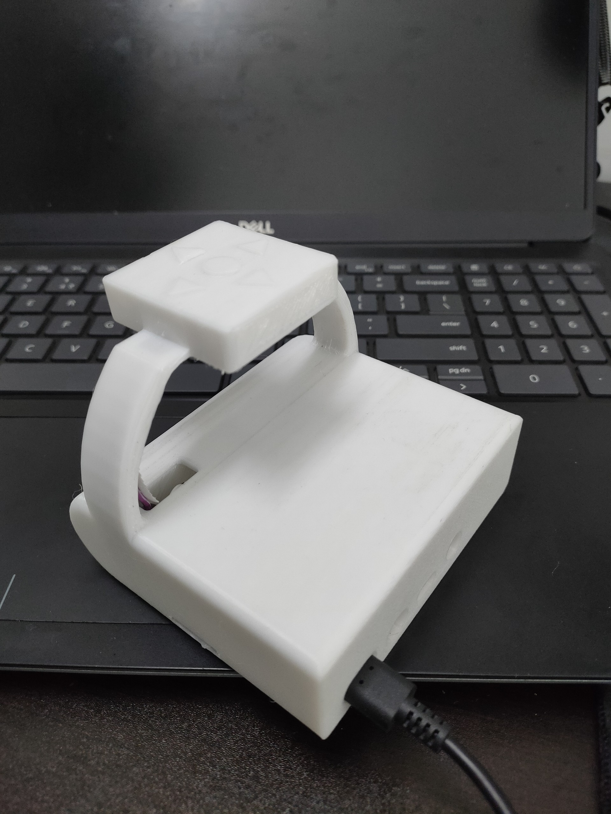

# Control Robot ROS

> Control a **differential-drive robot simulated in Gazebo** using **ROS 1 Noetic** by physically tilting an **MPU-6050 IMU sensor** connected to a **Raspberry Pi 4**. The Raspberry Pi reads tilt angles via a complementary filter and publishes wheel velocity commands over the ROS network to the Gazebo simulation running on an Ubuntu PC. No real motors are required.

---

## Table of Contents

- [System Overview](#system-overview)
- [Hardware Requirements](#hardware-requirements)
- [MPU-6050 Wiring](#mpu-6050-wiring)
- [Software Prerequisites](#software-prerequisites)
- [Network Configuration](#network-configuration)
- [Ubuntu PC Setup](#ubuntu-pc-setup)
- [Raspberry Pi 4 Setup](#raspberry-pi-4-setup)
- [Running the Project](#running-the-project)
- [Control Mapping](#control-mapping)
- [Project Structure](#project-structure)
- [Pictures](#pictures)

---

## System Overview

```
┌──────────────────────────────────────┐        LAN / Wi-Fi        ┌───────────────────────────────────────────┐
│             Ubuntu PC                │ ◄───────────────────────► │            Raspberry Pi 4                 │
│                                      │  ROS Topics over TCP/IP   │                                           │
│  • ROS Master (roscore)              │                           │  • Node: control_velocity                 │
│  • Gazebo Simulation (my_diffbot)    │ ◄── Float64 wheel cmds ── │  • Reads MPU-6050 via I2C                 │
│  • joint1_velocity_controller        │                           │  • Complementary filter (α=0.98)          │
│  • joint2_velocity_controller        │                           │  • Publishes wheel velocity @ 5 Hz        │
└──────────────────────────────────────┘                           └────────────────────┬──────────────────────┘
                                                                                        │ I2C (SDA/SCL)
                                                                                ┌───────▼────────┐
                                                                                │   MPU-6050     │
                                                                                │  Accel + Gyro  │
                                                                                │  addr: 0x68    │
                                                                                └────────────────┘
```

- **Ubuntu PC** is the **ROS master**. It runs Gazebo with the `my_diffbot` differential-drive robot model and listens for wheel velocity commands.
- **Raspberry Pi 4** connects to the same local network, reads tilt angles from the MPU-6050 using a complementary filter, calculates per-wheel velocities, and publishes them to the Gazebo simulation. No real motors are involved.

---

## Hardware Requirements

| Component | Details |
|---|---|
| PC | Ubuntu 20.04 LTS, ROS Noetic, Gazebo |
| Raspberry Pi 4 | 2 GB RAM or higher, running Ubuntu Server 20.04 |
| MPU-6050 | 6-axis IMU (accelerometer + gyroscope), I2C interface, address 0x68 |
| Network | Both devices on the same Wi-Fi or wired LAN |

> This project is **simulation only**. The Gazebo `my_diffbot` model is the robot — no physical chassis, motor driver, or DC motors are needed.

---

## MPU-6050 Wiring

Connect the MPU-6050 to the **Raspberry Pi 4** GPIO header:

| MPU-6050 Pin | Raspberry Pi 4 Pin | GPIO |
|---|---|---|
| VCC | Pin 1 | 3.3V |
| GND | Pin 6 | GND |
| SDA | Pin 3 | GPIO 2 (SDA1) |
| SCL | Pin 5 | GPIO 3 (SCL1) |
| AD0 | GND | Set I2C address to 0x68 |
| INT | (optional) | — |

> **Note:** Do **not** connect VCC to 5V — the MPU-6050 logic is 3.3V.

Verify the sensor is detected after enabling I2C:

```bash
sudo i2cdetect -y 1
# Should show 0x68 in the output grid
```

---

## Software Prerequisites

### Ubuntu PC

1. **Install ROS Noetic:**

```bash
sudo sh -c 'echo "deb http://packages.ros.org/ros/ubuntu focal main" > /etc/apt/sources.list.d/ros-latest.list'
sudo apt install curl
curl -s https://raw.githubusercontent.com/ros/rosdistro/master/ros.asc | sudo apt-key add -
sudo apt update
sudo apt install ros-noetic-desktop-full
```

2. **Source ROS and add to `.bashrc`:**

```bash
echo "source /opt/ros/noetic/setup.bash" >> ~/.bashrc
source ~/.bashrc
```

3. **Install catkin tools and build dependencies:**

```bash
sudo apt install python3-catkin-tools python3-rosdep python3-rosinstall
sudo rosdep init
rosdep update
```

4. **Install Gazebo (included with `desktop-full`) and verify:**

```bash
gazebo --version
```

5. **Install Gazebo ROS controllers** (required for `my_diffbot` wheel velocity controllers):

```bash
sudo apt install ros-noetic-gazebo-ros-pkgs ros-noetic-gazebo-ros-control
sudo apt install ros-noetic-ros-controllers ros-noetic-ros-control
```

---

### Raspberry Pi 4

1. **Flash Ubuntu Server 20.04 ARM64** onto an SD card using [Raspberry Pi Imager](https://www.raspberrypi.com/software/).

2. **Install ROS Noetic (ARM):**

```bash
sudo sh -c 'echo "deb http://packages.ros.org/ros/ubuntu focal main" > /etc/apt/sources.list.d/ros-latest.list'
curl -s https://raw.githubusercontent.com/ros/rosdistro/master/ros.asc | sudo apt-key add -
sudo apt update
sudo apt install ros-noetic-ros-base
echo "source /opt/ros/noetic/setup.bash" >> ~/.bashrc
source ~/.bashrc
```

3. **Enable I2C interface:**

```bash
sudo apt install i2c-tools
sudo usermod -aG i2c $USER
# Add to /boot/firmware/config.txt:
echo "dtparam=i2c_arm=on" | sudo tee -a /boot/firmware/config.txt
sudo reboot
```

4. **Install Python dependencies for MPU-6050:**

```bash
sudo apt install python3-pip python3-smbus
pip3 install smbus2
```

5. **Install catkin tools:**

```bash
sudo apt install python3-catkin-tools python3-rosdep
sudo rosdep init
rosdep update
```

---

## Network Configuration

Both machines must be on the **same local network**. The Ubuntu PC runs `roscore` and acts as the ROS master.

### On Ubuntu PC

Find your IP address:

```bash
hostname -I
# Example: 192.168.1.100
```

Add to `~/.bashrc`:

```bash
export ROS_MASTER_URI=http://192.168.1.100:11311
export ROS_IP=192.168.1.100
```

### On Raspberry Pi 4

Find your IP address:

```bash
hostname -I
# Example: 192.168.1.101
```

Add to `~/.bashrc`:

```bash
export ROS_MASTER_URI=http://192.168.1.100:11311   # Ubuntu PC's IP
export ROS_IP=192.168.1.101                         # Raspberry Pi's own IP
```

Apply on both machines:

```bash
source ~/.bashrc
```

> **Tip:** Assign static IPs to both devices in your router settings to avoid having to update these values after each reboot.

---

## Ubuntu PC Setup

1. **Extract the Ubuntu ROS package:**

```bash
cd ~/
cp /path/to/Control_Robot_ROS/Package_ROS_on_Ubuntu/catkin_ws.zip ~/
unzip catkin_ws.zip
cd ~/catkin_ws
```

2. **Install package dependencies:**

```bash
rosdep install --from-paths src --ignore-src -r -y
```

3. **Build the workspace:**

```bash
catkin_make
# or using catkin tools:
catkin build
```

4. **Source the workspace:**

```bash
source ~/catkin_ws/devel/setup.bash
# Add permanently:
echo "source ~/catkin_ws/devel/setup.bash" >> ~/.bashrc
source ~/.bashrc
```

---

## Raspberry Pi 4 Setup

1. **Transfer the Raspberry Pi package** to the Pi (via USB, SCP, or shared folder):

```bash
# From Ubuntu PC:
scp /path/to/Control_Robot_ROS/Package_control_raspberrypi/catkin_ws.zip pi@192.168.1.101:~/
```

2. **SSH into the Raspberry Pi:**

```bash
ssh ubuntu@192.168.1.101
```

3. **Extract and build:**

```bash
cd ~/
unzip catkin_ws.zip
cd ~/catkin_ws
rosdep install --from-paths src --ignore-src -r -y
catkin_make
```

4. **Source the workspace:**

```bash
source ~/catkin_ws/devel/setup.bash
echo "source ~/catkin_ws/devel/setup.bash" >> ~/.bashrc
source ~/.bashrc
```

---

## Running the Project

Follow these steps **in order**. The Ubuntu PC must have `roscore` and Gazebo running before starting the Raspberry Pi node.

### Step 1 — Start ROS Master (Ubuntu PC)

Open a terminal on the Ubuntu PC:

```bash
roscore
```

Leave this terminal open. Wait until you see:
```
started core service [/rosout]
```

### Step 2 — Launch Gazebo Simulation (Ubuntu PC)

Open a new terminal:

```bash
roslaunch <your_package_name> gazebo.launch
```

> Replace `<your_package_name>` with the ROS package name found inside `Package_ROS_on_Ubuntu/catkin_ws/src/`.

The Gazebo window will open and display the `my_diffbot` differential-drive robot. Wait until Gazebo finishes loading before proceeding.

### Step 3 — Start MPU-6050 Control Node (Raspberry Pi 4)

SSH into the Raspberry Pi from a new terminal on the Ubuntu PC:

```bash
ssh ubuntu@192.168.1.101
```

Run the control node:

```bash
rosrun <your_raspberrypi_package_name> mpu_control.py
```

You should see live output in the terminal:
```
Roll: 2.34, Pitch: -1.10, Vel_R: 0.00, Vel_L: 0.00
```

Tilting the MPU-6050 beyond ±20° will move the robot in the Gazebo simulation.

### Step 4 — Verify Topics (Ubuntu PC)

In another terminal, confirm wheel velocity commands are being received:

```bash
rostopic list
# Verify these topics exist:
# /my_diffbot/joint1_velocity_controller/command
# /my_diffbot/joint2_velocity_controller/command

rostopic echo /my_diffbot/joint1_velocity_controller/command
```

### Step 5 — Stop Everything

Stop in reverse order:
1. `Ctrl+C` on the Raspberry Pi `mpu_control.py` node
2. `Ctrl+C` on the Gazebo launch
3. `Ctrl+C` on `roscore`

---

## Control Mapping

Tilt the MPU-6050 module to control the robot in Gazebo. A **complementary filter (α = 0.98)** fuses accelerometer and gyroscope data to calculate stable roll and pitch angles.

| Tilt Axis | Direction | Angle Threshold | Robot Action |
|---|---|---|---|
| **Roll** | Tilt forward | > +20° | Move forward |
| **Roll** | Tilt backward | < −20° | Move backward |
| **Pitch** | Tilt right | > +20° | Turn right (while moving) |
| **Pitch** | Tilt left | < −20° | Turn left (while moving) |
| Both axes | Flat / level | Within ±20° | **Stop** (dead zone) |

**Velocity behaviour:**
- Speed increases progressively as tilt angle increases (from 20° up to 90°)
- An **acceleration factor** smoothly reduces the speed multiplier at extreme tilt angles
- Maximum wheel velocity is approximately **30 rad/s** at 90° tilt

**ROS Topics published (Float64):**

| Topic | Description |
|---|---|
| `/my_diffbot/joint1_velocity_controller/command` | Right wheel velocity |
| `/my_diffbot/joint2_velocity_controller/command` | Left wheel velocity |

**ROS Node:** `control_velocity` &nbsp;|&nbsp; **Publish rate:** 5 Hz &nbsp;|&nbsp; **Filter sample rate:** 200 Hz (dt = 0.005 s)

---

## Project Structure

```
Control_Robot_ROS/
├── Package_ROS_on_Ubuntu/
│   └── catkin_ws.zip          # ROS workspace for Ubuntu PC
│                              # Contains: my_diffbot robot description (URDF),
│                              #           Gazebo world & launch files,
│                              #           joint velocity controllers config
├── Package_control_raspberrypi/
│   └── catkin_ws.zip          # ROS workspace for Raspberry Pi 4
│                              # Contains: mpu_control.py
│                              #   - Reads MPU-6050 via I2C (smbus)
│                              #   - Complementary filter for roll/pitch
│                              #   - Publishes Float64 wheel velocities
│                              #     to /my_diffbot/joint*_velocity_controller/command
└── Picture/
    ├── Robot_in_Gazebo.jpg    # my_diffbot robot in Gazebo simulation
    └── Tay_cam.jpg            # Hand-held MPU-6050 controller
```

---

## Pictures

### Robot in Gazebo Simulation



### MPU-6050 Hand Controller



---

## Author

**Thái Việt Cường** — [cuongcodeF4](https://github.com/cuongcodeF4)

---

## License

This project is open source. Feel free to use and modify it for educational purposes.
